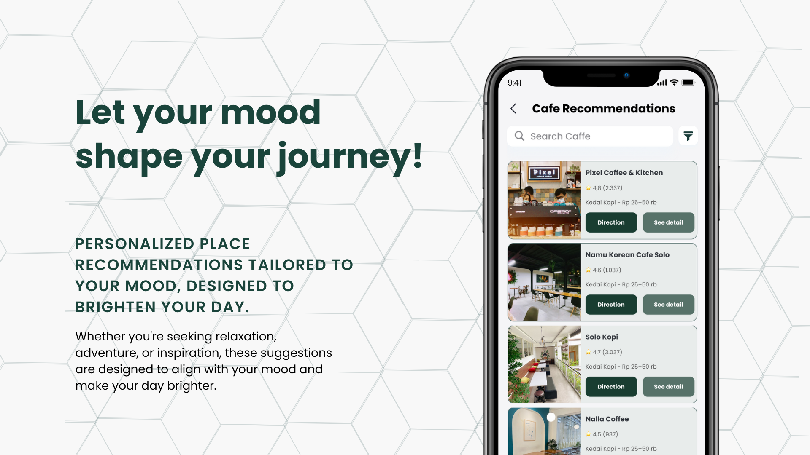
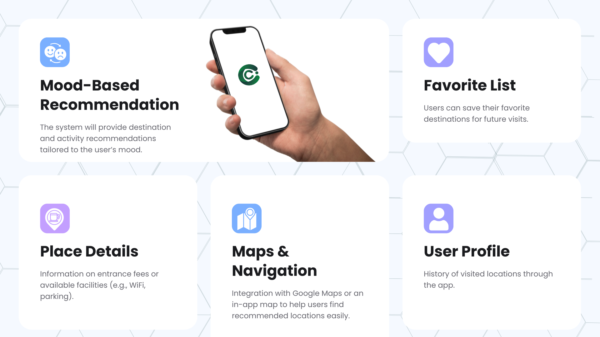

  
  
CultureConnect

  <i style="font-weight: 300;">Personalized place recommendations tailored to your mood, designed to brighten your day!</i>

  

## About the Application

This application is designed to bridge that gap, assisting users in finding ideal spots based on their current feelings and desired environments. By integrating mood-based suggestions, the app personalizes recommendations to align with users' emotional states, simplifying their search for the perfect destination. In this way, the app offers a curated, stress-free approach to "healing" that meets the growing demand for intentional, mood-aligned experiences.

### Insights & Market Research

- **72% of Gen Z travelers** prefer experiences that resonate with their personal values and emotions.
- **66% of Gen Z travelers** seek unique and personalized travel experiences.

In Indonesia, where diverse cultural and natural attractions offer endless opportunities for exploration, catering to these preferences is essential for enhancing tourism. By leveraging these insights, our application aims to cater to the unique preferences of Gen Z travelers, providing them with tailored recommendations that enhance their overall travel experience.

## Motivation

Our team is driven by the desire to transform travel into a more intimate and satisfying journey. By focusing on the emotional aspect of travel, we believe we can offer a solution that not only addresses a common pain point but also enhances the way people explore new destinations.

In developing this solution, we are committed to employing **design thinking methodologies** to ensure that our approach is user-centric and effectively meets the needs of travelers seeking personalized experiences.

## Technology Stack

### Machine Learning Tools

  
  
  
  

### Cloud Computing Tools

  
  
  
  
  
  
  
  
  
  
  
  
  

### Mobile Development Tools

  
  

### Database

  
  

### Support Tools

  
  
  
  
  
  

---

  <h3 style="font-size: 24px; font-weight: bold; margin-bottom: 10px;">Competitor Analysis</h3>
  <h4 style="font-size: 20px; font-weight: bold; margin-bottom: 20px;">Features</h4>

  <table border="1" style="border-collapse: collapse; width: 80%; text-align: center;">
    <thead style="background-color: #f4f4f4;">
      <tr>
        <th style="padding: 10px; font-weight: bold;">Features</th>
        <th style="padding: 10px; font-weight: bold;">Tripadvisor</th>
        <th style="padding: 10px; font-weight: bold;">Google Maps</th>
        <th style="padding: 10px; font-weight: bold;">Klook</th>
        <th style="padding: 10px; font-weight: bold;">Culture Connect</th>
      </tr>
    </thead>
    <tbody>
      <tr>
        <td style="padding: 10px;">Mood-based recommendation</td>
        <td style="padding: 10px;">❌</td>
        <td style="padding: 10px;">❌</td>
        <td style="padding: 10px;">❌</td>
        <td style="padding: 10px; background-color: #d4edda;">✅</td>
      </tr>
      <tr style="background-color: #f9f9f9;">
        <td style="padding: 10px;">Personalized recommendations</td>
        <td style="padding: 10px;">❌</td>
        <td style="padding: 10px;">❌</td>
        <td style="padding: 10px;">❌</td>
        <td style="padding: 10px; background-color: #d4edda;">✅</td>
      </tr>
      <tr>
        <td style="padding: 10px;">Mood tracking feature</td>
        <td style="padding: 10px;">❌</td>
        <td style="padding: 10px;">❌</td>
        <td style="padding: 10px;">❌</td>
        <td style="padding: 10px; background-color: #d4edda;">✅</td>
      </tr>
      <tr style="background-color: #f9f9f9;">
        <td style="padding: 10px;">Exclusive discounts and promotions</td>
        <td style="padding: 10px;">❌</td>
        <td style="padding: 10px;">❌</td>
        <td style="padding: 10px; background-color: #d4edda;">✅</td>
        <td style="padding: 10px; background-color: #d4edda;">✅</td>
      </tr>
      <tr>
        <td style="padding: 10px;">Collaborations with local businesses</td>
        <td style="padding: 10px;">❌</td>
        <td style="padding: 10px;">❌</td>
        <td style="padding: 10px; background-color: #d4edda;">✅</td>
        <td style="padding: 10px; background-color: #d4edda;">✅</td>
      </tr>
    </tbody>
  </table>

  <h3>Our Team</h3>
  <table align="center">
    <tr>
      <th>Bangkit ID</th>
      <th>Name</th>
      <th>Learning Path</th>
      <th>Profile</th>
    </tr>
    <tr>
      <td>M008B4KY0388</td>
      <td>Alif Rizqullah Ma'ruf </td>
      <td>Machine Learning</td>
      <td>
        
        
      </td>
    </tr>
    <tr>
      <td>M297B4KY0994</td>
      <td>Daniel Ridho Abadi </td>
      <td>Machine Learning</td>
      <td>
        
        
      </td>
    </tr>
    <tr>
      <td>M312B4KY2853</td>
      <td>Muhammad Fikri Abdullah </td>
      <td>Machine Learning </td>
      <td>
        
        
      </td>
    </tr>
    <tr>
      <td>A391B4KY1262</td>
      <td>Emmanuel Krishnandito Laksana </td>
      <td>Mobile Development</td>
      <td>
        
        
      </td>
    </tr>
    <tr>
      <td>A008B4KY2885</td>
      <td>Muhammad Harits Detya Irawan </td>
      <td>Mobile Development</td>
      <td>
        
        
      </td>
    </tr>
    <tr>
      <td>C128B4KY3889</td>
      <td>Rivan Anjung Sinar Permana </td>
      <td>Cloud Computing</td>
      <td>
        
        
      </td>
    </tr>
       <tr>
      <td>C391B4KY4424</td>
      <td>Vincensius Damar Adyatma</td>
      <td>Cloud Computing</td>
      <td>
        
        
      </td>
    </tr>
  </table>

 

## App Showcase

 
 
 
